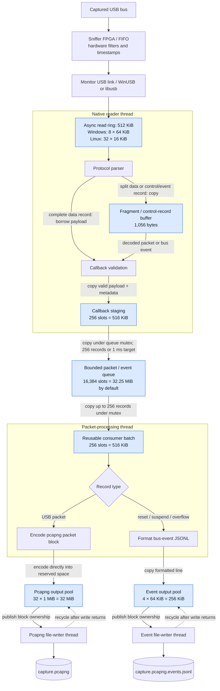

# Native capture data flow and buffers

This diagram describes the native WinUSB/libusb paths with the default
16,384-slot packet queue. Blue nodes are explicit application buffers; arrows
label payload copies and thread handoffs. Hardware, driver, C++ stream, and OS
file-cache buffering are separate. The user-reported 8 MB sniffer FIFO has not
been independently measured; it is excluded from the host-buffer totals below.

There are seven explicit buffers/pools: the read ring, parser fragment buffer,
callback staging, packet queue, consumer batch, and two output pools.
On the tested Windows builds a `PacketSlot` occupies 2,064 bytes: room for a
2,048-byte payload plus metadata and alignment. The native protocol currently
limits packet payloads to 1,050 bytes. Slot capacity is reserved even for short
packets such as NAKs; copies use actual payload length.

## Sizes and definitions

| Buffer | Capacity | Definition |
| --- | --- | --- |
| Pending Windows reads | 524,288 bytes | [`capture_read_bytes`, `capture_read_count`, `Device::capture`](../../src/usbpv_native.cpp) |
| Pending Linux reads | 524,288 bytes | [`capture_read_bytes`, `capture_read_count`, `Device::capture`](../../src/usbpv_native_linux.cpp) |
| Parser fragment record | 1,056 bytes | [`ProtocolParser::record_`](../../src/usbpv_protocol.hpp) |
| Reader callback staging | 528,384 bytes | [`CaptureContext::pending`, 256 slots](../../src/usbpv_capture_queue.hpp) |
| Shared packet/event queue | 33,816,576 bytes by default | [`PacketQueue::slots_`, `PacketSlot`](../../src/usbpv_queue.hpp); capacity comes from [`kDefaultQueueCapacity` / `--queue-capacity`](../../src/usbpv_capture.cpp) |
| Consumer batch | 528,384 bytes | [`writer_thread`, `batch(256)`](../../src/usbpv_capture.cpp) |
| Pcapng output pool | 33,554,432 bytes | [`BufferedOutput::block_bytes`, `block_count`](../../src/usbpv_output.hpp) |
| Event output pool | 262,144 bytes | [`writer_thread`, `event_output(64 * 1024, 4)`](../../src/usbpv_capture.cpp) |

These backing arrays total about **66.01 MiB** with the default queue. This is
not total process memory: it excludes thread stacks, allocator/container
overhead, output bookkeeping, temporary strings, FPGA setup data, libraries,
and driver/OS buffers. The **32 MiB output pool is separate from the 32.25 MiB
packet queue**. Changing `--queue-capacity` changes only the latter.

The read ring's 512 KiB is nominal allocation, not guaranteed burst headroom:
a short USB completion consumes a whole read slot until it is serviced and
resubmitted. Linux uses a 250-microsecond coalescing target during active
SuperSpeed monitor capture; OS scheduling may delay service further. See the
[burst tests and FIFO analysis](../reports/2026-09-27/linux-native.md#burst-margin-and-the-reported-8-mb-device-fifo)
for measured recovery and limitations.

## Publication, ownership, and failure

The reader owns the parser and callback staging. A complete data record can
borrow bytes directly from a read buffer, but the callback copies them before
that read is resubmitted. Split records are assembled in `record_` first.
Startup callbacks are discarded until acceptance is enabled; invalid packets
and speed mismatches are counted rather than staged.

Full callback batches publish immediately. Partial batches span transfers
with a 1 ms target; active traffic does not extend their deadline. A pending
batch causes a 1 ms reader wait, whose timeout forces publication. Stop,
parser errors, and reader exit also publish the tail. OS scheduling can
exceed this target. Host activity and total callbacks update per transfer;
accepted-packet counters update when batches enter the queue.

The queue accepts the prefix that fits and drops/counts the remaining new
records. Any queue loss makes the final capture incomplete. The consumer
copies records out before encoding, allowing the reader to reuse queue slots.

Each output pool includes the producer's active block, published blocks, and
the block being written; there is no additional full-size writer copy. Blocks
publish when the next record will not fit, on periodic flush requests (roughly
once per second), and on finish. File workers return blocks only after their
writes complete. Output-pool exhaustion or write failure fails capture
explicitly. `output_pending_peak_bytes` counts published pcapng bytes waiting
for or inside a write and excludes the active producer block.

The main control thread handles ready/stop files and capture limits. Shutdown
disables acceptance, closes/joins the reader, stops the queue, then joins
packet processing and its draining output workers before writing the final
summary JSON. The diagram shows steady-state data flow; pcapng headers and
ready/summary JSON are written separately during setup/shutdown.

See the [capture guide](../guides/agent-capture.md) and
[CPU measurements](../reports/2026-09-27/cpu-optimization.md) for operation and
the measured effect of batching across transfers.
